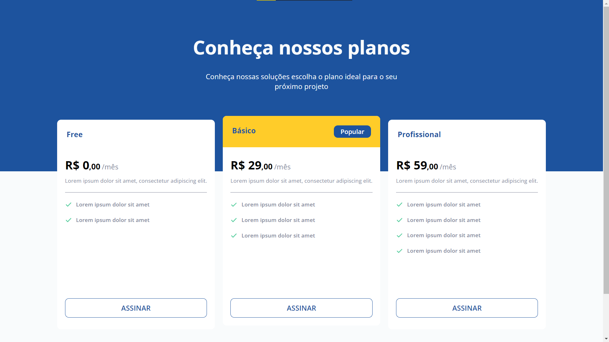

# PricingTable
 Página para mostrar as opções de planos disponíveis para assinatura
  
 ## Layout Preview
 

|Desktop Version | Mobile Version|
|----------------| ---------------|
|  | |

## Sobre o projeto 

Esse projeto foi criado a partir de um dos desafios do Discover, da plataforma de ensino [Rocketseat](https://app.rocketseat.com.br/discover).

Uma página para mostrar as opções de planos disponíveis para assinatura, com um layout completamente responsivo a todos os tipos de telas

Para mais informações sobre o desafio você pode conferir [AQUI](https://efficient-sloth-d85.notion.site/Desafio-Pricing-Table-e0b6f59253e54d229fdde09228226b32).

## Tecnologias 

As tecnologias usadas foram:

   HTML5
   CSS
 

